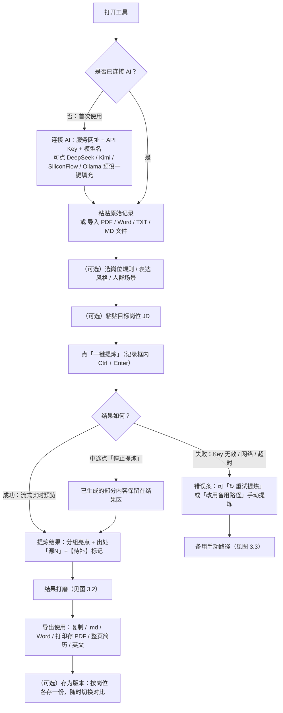
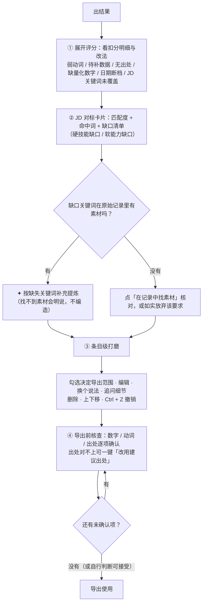
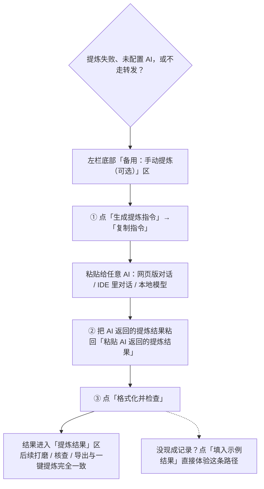

# 项目经历亮点提炼器 · 使用说明书

> 一句话：把 git 提交日志、日报、待办清单等零散工作记录，用你自己的 AI Key 一键提炼成简历可用的项目亮点——**每条都标出处、无依据的标【待补】，绝不编造**。
>
> 适用环境：Chrome / Edge / Safari 等现代浏览器。数据默认只存本机。

---

## 目录

1. [它解决什么问题](#1-它解决什么问题)
2. [30 秒快速上手](#2-30-秒快速上手)
3. [流程图](#3-流程图)
4. [分步详解](#4-分步详解)
5. [隐私与数据](#5-隐私与数据)
6. [常见问题（FAQ）](#6-常见问题faq)
7. [快捷键与操作速查](#7-快捷键与操作速查)
8. [术语表](#8-术语表)
9. [本次基于说明书与流程图的优化](#9-本次基于说明书与流程图的优化)

---

## 1. 它解决什么问题

| | 输入 | 输出 |
|---|---|---|
| 你提供 | 原始记录（不用整理、不用排版） | —— |
| 工具给出 | —— | 分组项目亮点（新增能力 / 优化提升 / 问题修复）+ 出处「源N」+ 面试展开点 |

核心承诺（贯穿全流程的三条底线）：

- **不编造**：只基于你给的记录；缺数据的条目自动标【待补：缺什么】。
- **可核查**：每条亮点标注来源行号「源N」，点开就能对照原文；导出前有逐项核查清单。
- **数据本地**：记录、结果、Key、版本全部只存你的浏览器；只有点 AI 按钮时才把当次文本发给你自己配置的服务商。

适合：有工作记录但不会写简历的人、海投需要按岗位改简历的人、想用 AI 但担心数据外泄的人。

---

## 2. 30 秒快速上手

**首次使用先「连接 AI」（只需一次）**：点页头「连接 AI」→ 点一个服务商预设（如 DeepSeek）→ 粘贴你自己的 API Key → 点「测试连接」→ 保存。

之后就是三步：

1. **粘贴记录**：把 git 日志 / 日报 / 待办直接粘进左栏「原始记录」（或点「导入文件」传 PDF / Word / TXT / MD）。
2. **（可选）选规则、填 JD**：默认已选好一套岗位预设，直接提炼即可；想更准就换预设、粘贴目标岗位 JD。
3. **点「一键提炼」**：结果实时流式出现在右栏 → 打磨（评分 / 补缺口 / 改条目）→ 过一遍「导出前核查」→ 导出到简历。

> 页头「使用说明」可随时打开精简版；本文件是完整版。

---

## 3. 流程图

### 3.1 主流程（从打开到导出）

### 3.2 结果打磨与导出动线

### 3.3 备用手动路径（不连 AI / 转发不可用 / 想用外部 AI）

> 一键提炼的原始返回也会出现在「备用」区：可修改后点「格式化并检查」重新解析，已存的版本不受影响。

---

## 4. 分步详解

### 4.1 首次配置：连接 AI（BYOK，用自己的 Key）

点页头「连接 AI」打开设置面板：

| 服务商 | 服务网址（自动填充） | 模型名（自动填充） | 说明 |
|---|---|---|---|
| DeepSeek | `https://api.deepseek.com` | `deepseek-chat` | 便宜，中文好；点面板里的「去申请」拿 Key |
| Kimi | `https://api.moonshot.cn/v1` | `moonshot-v1-8k` | 长上下文 |
| SiliconFlow | `https://api.siliconflow.cn/v1` | `deepseek-ai/DeepSeek-V3` | 模型选择多 |
| 本地 Ollama | `http://localhost:11434/v1` | 填 `ollama list` 里的名称（如 `qwen2.5:7b`） | 无需 Key；仅本机运行工具时可用 |

要点：

- **Key 只存在你的浏览器 localStorage**，本工具不收集、不上传；输入框旁「显示 / 隐藏」可随时核对。
- 点「测试连接」可当场验证地址 / Key / 模型是否可用，避免提炼时才报错。
- 请求经本工具的同源代理转发，**无需服务商支持 CORS**；代理规则：`https` 地址全部放行，`http` 仅限本机回环地址（localhost / 127.x / ::1）。
- 「隐私与本地数据」区可查看本地占用、清空草稿 / 版本库、导出 / 导入备份（**备份不含 Key**）。

### 4.2 第一步：粘贴原始记录

- **直接粘**：git log、日报、周报、待办（`[x]` 也行），不用整理格式，行号由工具自动编。
- **导入文件**：支持 `.pdf / .docx / .txt / .md`（15MB 内），纯本地解析，零上传。
- **多段记录**：不同项目/公司之间用单独一行的 `---` 分隔，提炼时会要求每条亮点归属对应项目段，不混写。
- **两个提前提示**：少于 3 行会提示「提炼效果可能有限」；超过 8000 字会提示按项目分段提炼（避免超出模型上下文）。
- 「填入示例」可一键塞入示例记录，配合右栏直接体验；记录框内按 `Ctrl + Enter` 等于点「一键提炼」。

### 4.3 第二步：选规则（可选）

默认已选「前端技术岗」预设，直接提炼即可。想更贴合时：

- **岗位预设**：前端技术岗 / 后端技术岗 / 算法数据岗 / 产品经理 / 运营增长 / 偏业务方向。
- **✦ AI 定制**：把已粘贴的记录发给 AI，自动生成一套专属规则（生成后仍可手工改）。
- **表达风格**（与岗位正交）：默认 / STAR 叙事 / XYZ 法则 / 量化优先 / 动词引领 / 中英对照。
- **人群场景**：通用 / 应届无经验 / 转行 / 空窗期——对应各自的引导话术，且都不虚构经历。
- **规则可分享**：「导出规则」存为 JSON 发给同伴，「导入规则」一键复用。
- 底部「当前组合」一行随时显示你将使用哪套组合，点「预览最终指令」可在「备用」区看到完整指令原文。

### 4.4 第三步：一键提炼

- 点击后按钮变为「提炼中… Ns 点击停止」，**生成内容实时出现在右栏**，不必盲等。
- 想中断：点主按钮或结果区头部「⏹ 停止提炼」，已生成的部分会保留、可继续用。
- 失败时：按钮下方出现红色错误条 + 「↻ 重试提炼」；也可点「改用备用路径」直接转手动提炼（见 4.8）。
- 常见错误含义：401/403 → Key 无效；429 → 频率受限稍后再试；「无法连接转发服务」→ 本地开发未用 `iga pages dev` 启动，或部署环境异常；超时 → 换服务商或重试。
- **覆盖保护**：再次提炼前，若当前结果尚未存档，会先自动存一份「自动快照」（在版本面板里可一键清理）。

### 4.5 第四步：打磨结果

**① 评分（0–100）**：点结果区顶部「评分」展开扣分明细——弱动词、待补数据、无出处、缺量化数字、日期断档、JD 关键词未覆盖，每项都带「改法」，可复制；点条目数可定位到对应行。

**② JD 对标**：填入目标岗位 JD 后（左栏「对标岗位 JD」），结果区显示匹配度环、命中关键词、缺口清单（硬技能 / 软能力分组）。每个缺口可：
- 「✦ 补充提炼」：只针对这个关键词重审原始记录，无素材会明确回复「无相关素材」，不编造；
- 「在记录中找素材」：直接列出记录里含该词的原文行，自己判断要不要写。

**③ 条目级操作**（每条亮点一行）：
- **勾选**：决定导出范围（未勾选仍保留在结果区，半透明显示）；
- ** 编辑**：手工微调，导出同步更新；
- **⟳ 换个说法**：AI 只改表达不改事实，改写引入的新数字若不在出处原文里会自动标【待补】；点「对比修改前」看原句；
- **＋ 追问细节**：素材太薄时，AI 先问 2–3 个补强问题，你回答后结合原记录改写（同样有数字防编造保护）；
- **删除 / ↑ / ↓**：删除不再出现的条目、调整顺序；
- **⟲ 源 N**：展开该条对应的原始记录行，核对出处；
- ** 撤销上一步**（或 `Ctrl + Z`）：回退最近一次内容改动，最多 20 步。

**④ 面试追问**（🎯）：基于勾选条目生成 5 个面试官最可能追问的问题，可「练一练」逐题作答、让 AI 点评，或「复制清单」发给同伴模拟面试。

### 4.6 第五步：导出使用

先过 **导出前核查**：数字核对、动词强度、出处可查三类逐项打勾；「源N」行号对不上内容的，可一键「改用建议出处」。核查状态只在本次会话保留，不影响草稿与版本。

导出方式（只包含**勾选**的条目）：

| 方式 | 适合 |
|---|---|
| 一键复制 | 纯文本（Markdown）粘贴到任何地方 |
| 复制带格式 | 粘贴进 Word / 在线编辑器保留加粗与列表 |
| 下载 .md / .txt | 存档、二次编辑 |
| 下载 Word | 可选「ATS 友好版式」：单栏、无表格、标准小节标题 |
| 打印 / 存 PDF | 浏览器打印视图，可直接存 PDF |
| 整页简历 | 填姓名 / 联系方式 / 岗位，套单页 A4 模板打印或存 PDF / 下载 HTML |
| 译成英文 | AI 翻译当前勾选内容，可编辑、可复制；译文过期（条目改动后）会提示重译 |

**ATS 提示**：网申建议用纯文本形态，避免表格、双栏与图标；粘贴后检查换行是否完整。

### 4.7 存档与多岗位（结果下方存档面板）

- **存为版本**：把「记录 + 规则 + JD + 结果」整包存档，可填目标岗位标签（如「字节-前端」）。
- **按岗位新建**：预填当前岗位名，复制当前工作区内容，一次生成一版。
- **岗位筛选**：海投多岗位时按岗位对照各版本；点版本名即载入（载入前会提示覆盖风险，未存档内容会升级为强警告）。
- **对比**：任选两个版本并排对照——行级差异高亮 + 两侧 JD 匹配度 + 缺口差异（哪些关键词从「缺」变「有」）。
- **自动快照**：每次覆盖前自动生成的存档（灰色显示），可「清理快照(N)」一键清理，不影响手动命名的版本。
- 存储于浏览器 IndexedDB，刷新、关机会话都在；换浏览器 / 换电脑请用设置里的「导出备份」。

### 4.8 备用手动路径（不连 AI 也能用）

不配置 AI、转发临时不可用、或你想用别的 AI（网页版对话、IDE 里对话、本地模型）时：

1. 左栏底部「备用：手动提炼（可选）」→「生成提炼指令」→「复制指令」；
2. 把指令粘贴给任意 AI，拿到返回结果；
3. 把返回结果粘回「② 粘贴 AI 返回的提炼结果」→ 点「格式化并检查」。

结果同样进入「提炼结果」区，打磨 / 核查 / 导出完全一致。没现成返回？点「填入示例结果」可直接体验这条路径。

### 4.9 数据看板（页脚）

页脚「数据看板」：累计提炼次数、成功率、平均耗时、近 7 天次数，以及带 JD 提炼的匹配度趋势柱状图（最近 20 次）——改一版看分数涨。全部数据仅存本机。

---

## 5. 隐私与数据

| 数据 | 存储位置 | 说明 |
|---|---|---|
| AI 连接设置（含 API Key） | 浏览器 localStorage | 仅本机；备份文件**不含** Key |
| 草稿（记录 / 规则 / JD / 结果 / 译文） | 浏览器 localStorage | 500ms 防抖自动保存，刷新恢复 |
| 版本库、自动快照 | 浏览器 IndexedDB | 可整包导出 / 导入 |
| 使用统计、核查勾选 | localStorage / sessionStorage | 核查勾选仅本次会话 |

**何时联网**：只有你点 AI 类按钮（一键提炼 / 换个说法 / 追问细节 / 补充提炼 / 面试追问 / 点评 / 翻译 / 测试连接）时，才把**该操作所需的文本**（如记录 + 规则，或单条亮点）经本工具代理发往**你自己配置的服务商**。工具本身不收集数据、不设遥测。

---

## 6. 常见问题（FAQ）

**Q：必须自己准备 API Key 吗？没有 Key 能用吗？**
A：一键提炼需要（DeepSeek 等按量计费，一次提炼几分钱甚至更少）。不想用 Key 就走「备用」区手动路径（见 4.8），功能完全一致。

**Q：提示「API Key 无效或无权限」？**
A：设置面板里核对三件事：服务网址是否带 `/v1`（面板预设已带好）、Key 是否复制完整、模型名是否拼对；点「测试连接」当场验证。

**Q：提示「无法连接转发服务（/api/ai）」？**
A：本地开发需用 `iga pages dev` 启动（提供同源代理）；线上请用部署后的地址访问。若地址都正确仍失败，多为网络环境拦截。

**Q：本地 Ollama 连不上？**
A：确认 Ollama 已运行（终端执行 `ollama list` 能看到模型）；服务网址填 `http://localhost:11434/v1`（http 仅限本机回环地址）；云端部署的版本无法访问你本机的端口，需本地运行工具。

**Q：AI 返回内容为空 / 未识别到分组？**
A：多为模型不兼容流式或输出格式跑偏；可换模型重试，或走手动路径把返回粘回来「格式化并检查」（支持 Markdown 列表，自动剥离多余格式）。

**Q：结果里出现【待补：…】意味着什么？**
A：该条缺少原始记录里的依据（常见于缺数字或无出处）。按提示回原始记录补事实，或在「导出前核查」里确认后删除标记——**不要直接把【待补】留在简历里**。

**Q：想换 AI 服务商 / 模型？**
A：设置面板直接改，随时切换；已提炼的结果与版本不受影响。

**Q：换电脑 / 换浏览器，数据怎么办？**
A：设置 →「导出备份」得到 JSON（不含 Key），在新环境「导入备份」；版本、草稿、统计一并恢复。

**Q：提炼结果不满意，怎么调效果最好？**
A：按影响从大到小：① 记录里多写数字与结果；② 换更贴岗位的规则预设或 AI 定制；③ 填目标岗位 JD 并补缺口；④ 用「换个说法 / 追问细节」逐条打磨。

---

## 7. 快捷键与操作速查

| 操作 | 位置 | 说明 |
|---|---|---|
| `Ctrl + Enter` | 记录输入框内 | 快速提炼 |
| `Ctrl + Z` | 结果区（非输入框） | 撤销最近一次结果改动 |
| `Esc` | 设置面板 / 使用说明 / 追问弹层 / 版本对照 | 关闭当前弹层 |

一键直达：页头「连接 AI」（配置）｜页头「使用说明」（精简手册）｜结果区「去填 JD」｜结果区「查看 AI 回复原文」｜页脚「数据看板」。

---

## 8. 术语表

- **源N**：亮点出处，N 是「原始记录」区左侧的行号（自动编号）；点「源 N」芯片可展开对应原文。
- **【待补：…】**：提醒你这条缺什么素材（数字 / 依据），补齐后再写进简历。
- **面试展开点**：每条亮点背后可展开的口述细节，默认不进导出，可勾选「包含面试展开点」。
- **自动快照**：再次提炼前对未存档结果的自动备份，可在存档面板一键清理。
- **备用路径**：不经过转发的手动提炼流程：生成指令 → 外部 AI → 粘回结果 → 格式化。

---

## 9. 本次基于说明书与流程图的优化

编写本说明书与流程图时发现 4 处「说明书写得出、产品做不到位」的断点，已同步优化：

1. **说明书本身没有入口**（最大断点）→ 页头新增「使用说明」按钮（页脚也可直达）：打开精简版手册弹层，含三步上手、打磨动线、备用手动路径、数据说明与快捷键；`Esc` / 点遮罩关闭。
2. **主流程的失败分支没有出口**（流程图 3.1 的 K 节点原来只能重试）→ 错误条新增「改用备用路径」：一键展开备用区并生成指令，直接可复制给任意 AI 继续干活。
3. **「导出只含勾选条目」易被误解**（图 3.2 的 X 节点）→ 未勾选任何条目时，导出区给出明确提示，且复制类按钮置灰（原来点了没反应、无任何反馈）。
4. **首访未配置时的引导自相矛盾**（图 3.1 的 B 分支）→ 未连接 AI 时点「填入示例试一试」，提示语改为指向页头常驻的「连接 AI」按钮，不再让用户先撞设置弹窗。